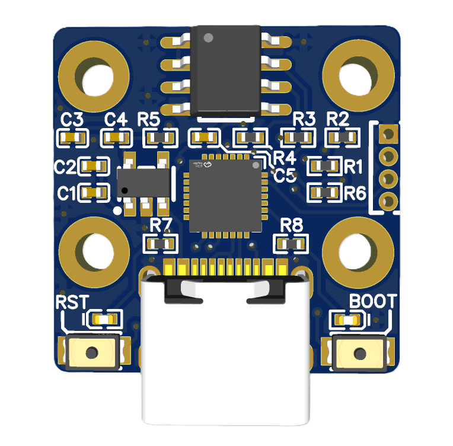
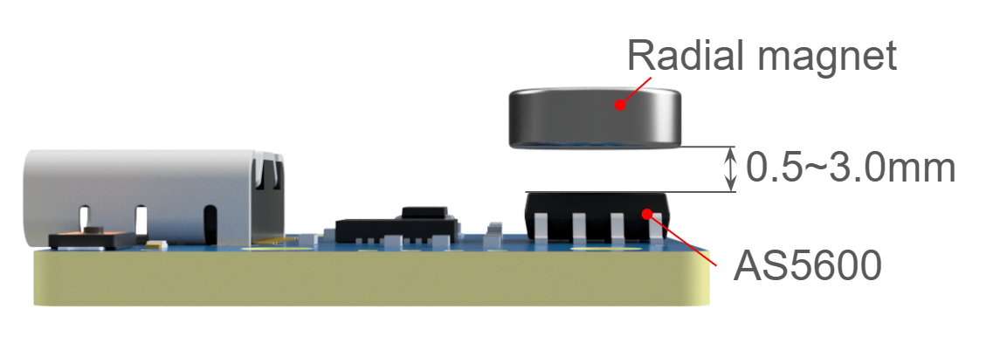
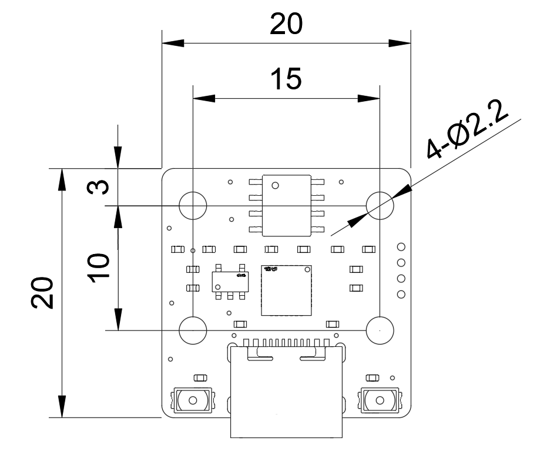

# encusb
A compact USB encoder interface board using the AS5600 magnetic rotary encoder.

This board reads the AS5600 angle data via I2C and outputs the encoder value through USB serial communication. It is designed for easy integration into robotics, motion control, and embedded systems.

## Features
- [AS5600(12-bit)](https://look.ams-osram.com/m/7059eac7531a86fd/original/AS5600-DS000365.pdf) magnetic encoder support
- USB serial angle output
- Error LED indicator
- Compatible with Arduino framework

## Usage
Please place the radial magnet above the AS5600 IC.

The position changes depending on the magnet size and magnetic strength. Please fine-tune the position so that the red LED on the PCB does not light up.

The PCB can be mounted with four M2 screws.

The board outputs the raw encoder angle value through USB serial.
- Baud rate: `115200` bps
- Range: `0 - 4095`

If the magnet is not detected, `-1` is output.
If the magnet position is not correct, the LED will light up red.

## Requirement
The following environment is required for the firmware update.
- [wchisp](https://github.com/ch32-rs/wchisp)

If you want to modify the software using the Arduino framework, the following environment is required.
- [Arduino IDE](https://docs.arduino.cc/software/ide/)
- [Adafruit TinyUSB](https://github.com/Adafruit/adafruit_tinyusb_arduino)
- [arduino_core_ch32](https://learn.adafruit.com/adafruit-qt-py-ch32v203/arduino-ide-setup)
  
The modified firmware cannot be uploaded directly from the Arduino IDE.
Run `Export Compiled Binary` in the Arduino IDE, then use wchisp to upload the generated `.bin` file.

## Update
When writing the firmware, connect the USB cable first, then press the BOOT SW followed by the RST SW.
If the LED turns off, the device is ready for firmware upload.

Run `wchisp.exe flash <encusb.bin>` in the terminal.
You can specify any location for `wchisp` and the `.bin` file.

## Author
- [Ryota Kobayashi](https://x.com/CH1H160/)